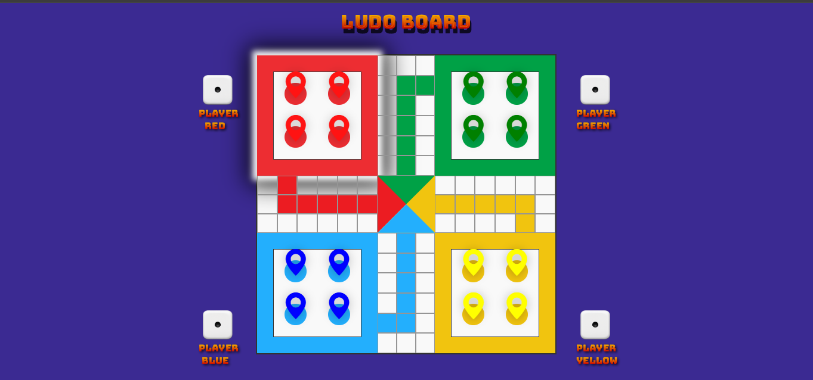

# 🎲 Ludo Game – Web-Based Multiplayer

This is a browser-based multiplayer **Ludo game**, developed using **HTML**, **CSS**, and **JavaScript**. It replicates the classic Indian board game with turn-based dice rolling, token movement, attack logic, and win detection.

---

## 🚀 Features

- 🎯 Turn-based multiplayer (Red, Green, Yellow, Blue)
- 🎲 Dice rolling per player with visual dice
- 🧍 Token movement from home to the board on rolling 6
- ➕ Step-by-step movement across custom paths
- 💥 Kill logic (send opponent token back to home)
- 🏁 Win detection when 4 tokens reach their goal
- 🔁 Automatic turn switching
- 🎨 Fully styled responsive Ludo board

---

## 🛠️ Technologies Used

- **HTML5** – Structure
- **CSS3** – Styling & Board Layout
- **JavaScript (ES6)** – Game Logic
- **Bootstrap Icons** – For game tokens

---
## ✨ Future Improvements

- Add piece stacking logic
- Highlight movable pieces
- Add animations and sound effects
- "Play Again" or Restart Game button
- AI opponent or Online multiplayer

---

